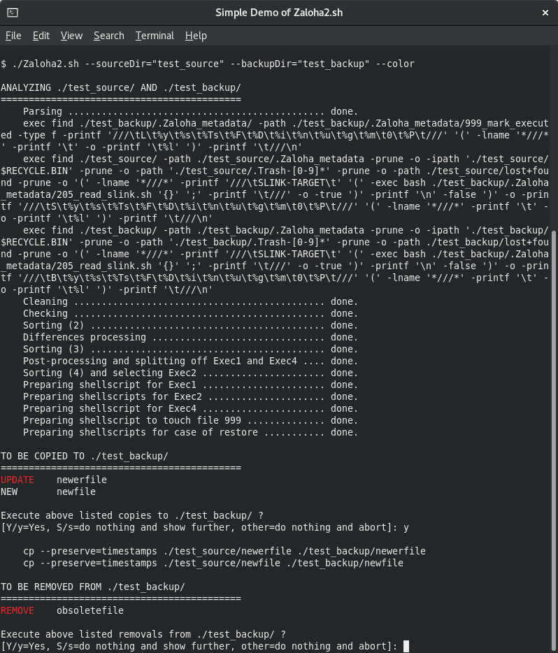

# Zaloha2.sh

Zaloha2 is a small and simple directory synchronizer:

 * Zaloha2 is a BASH script that uses only FIND, SORT and AWK.
 * All you need is the Zaloha2.sh file (contains ~113 kB of program code and ~98 kB of documentation).
 * No compilation, installation and configuration is required.
 * Cyber-secure: No new binary code, no new open ports, no talking to any
   "uncles" on the Internet, easily reviewable.
 * Three operation modes are available: the Local Mode, the Remote Source Mode and the Remote Backup Mode.
 * **Local Mode:** Both directories are available locally
   (local HDD/SSD, flash drive, mounted Samba or NFS volume).
 * **Remote Source Mode:** the source directory is on a remote source host that can be reached via SSH/SCP
   and the backup directory is available locally.
 * **Remote Backup Mode:** the source directory is available locally
   and the backup directory is on a remote backup host that can be reached via SSH/SCP.
 * Zaloha2 does not lock files while copying them. No writing on either directory may occur while Zaloha2 runs.
 * Zaloha2 always copies whole files via the operating system's CP command or the SCP command (= no delta-transfer like in RSYNC).
 * Zaloha2 is not limited by memory (metadata is processed as CSV files, no limits for huge directory trees).
 * Zaloha2 has optional reverse-synchronization features.
 * Zaloha2 can optionally compare the contents of files.
 * Zaloha2 prepares scripts for case of eventual restore.

Full documentation is available both [online](DOCUMENTATION.md) as well as inside of Zaloha2.sh.

On Linux/Unics, Zaloha2 runs natively. On Windows, Cygwin is needed.

## What are synchronization programs good for ?

[Read article here](https://fitus.github.io/).

## How does Zaloha2.sh work ?

### Explained in five sentences (the Local Mode)

 * FIND is executed to scan both directories to obtain CSV metadata about files and subdirectories.
 * The CSV metadata is compared by a sequence of sorts and AWK processing steps.
 * The results (= prepared synchronization actions) are presented to the user for confirmation.
 * If the user confirms, the synchronization actions are executed.
 * A non-interactive regime is available as well.

### Explained by an Interactive Flowchart

[Open Interactive JavaScript Flowchart here](https://fitus.github.io/flowchart.html).

### An insight into the CSV metadata is given here

[Open CSV data model here](https://fitus.github.io/data_model.html).

### Explained in full detail

Read the relevant sections in the [Documentation](DOCUMENTATION.md).

## Obtain Zaloha2.sh

The simplest way: Under the green button "<b>Code</b>" above, choose "<b>Download ZIP</b>".
From the downloaded ZIP archive, extract <code>Zaloha2.sh</code> and make it executable (<code>chmod u+x Zaloha2.sh</code>).

For running the Simple Demo, extract also the scripts <code>Simple_Demo_step1/2/3/4/5/6/7.sh</code> and make them executable.

## Usage Examples

**Basic Usage**: Synchronize <code>test_source</code> to <code>test_backup</code>:

```bash
Zaloha2.sh --sourceDir="test_source" --backupDir="test_backup"
```

Basic usage with **Colors** (on terminals with ANSI escape codes):

```bash
Zaloha2.sh --sourceDir="test_source" --backupDir="test_backup" --color
```

Besides the standard synchronization,
if there are files in <code>test_backup</code> that are newer (younger) than the corresponding files in <code>test_source</code>,
copy them back to <code>test_source</code> (**Reverse-Update**):

```bash
Zaloha2.sh --sourceDir="test_source" --backupDir="test_backup" --revUp
```

Besides the standard synchronization,
if there are files in <code>test_backup</code> that do not exist in <code>test_source</code>,
and those files are newer (younger) than the last run of Zaloha2,
copy them back to <code>test_source</code> (**Reverse-New**):

```bash
Zaloha2.sh --sourceDir="test_source" --backupDir="test_backup" --revNew
```

**Do Not Remove** objects from <code>test_backup</code> (unless the removals are unavoidable),
just add new files and subdirectories to <code>test_backup</code> (and/or update existing files in there):

```bash
Zaloha2.sh --sourceDir="test_source" --backupDir="test_backup" --noRemove
```

**Exclude subdirectories** <code>.git</code> from the synchronization.
If such subdirectories already exist in <code>test_backup</code>, they are considered obsolete (= removals are prepared):

```bash
Zaloha2.sh --sourceDir="test_source" --backupDir="test_backup" \
           --findSourceOps='( -type d -a -name .git ) -prune -o'
```

**Exclude files** with ending <code>.NFO</code> from the synchronization.
If such files already exist in <code>test_backup</code>, they are considered obsolete (= removals are prepared):

```bash
Zaloha2.sh --sourceDir="test_source" --backupDir="test_backup" \
           --findSourceOps='( -type f -a -name *.NFO ) -o'
```

**Generally Exclude files** with ending <code>.NFO</code> from the synchronization (never do anything with them).
Note that the option <code>--findGeneralOps</code> is used instead of <code>--findSourceOps</code>.
The <code>+</code> sign tells Zaloha2 to use the passed FIND expression **in addition** to the internally defined defaults:

```bash
Zaloha2.sh --sourceDir="test_source" --backupDir="test_backup" \
           --findGeneralOps='+( -type f -a -name *.NFO ) -o'
```

**Disable the internally defined defaults** for <code>--findGeneralOps</code> that exclude the well-known Linux and Windows
"trash" and "lost+found" subdirectories: Use the option <code>--findGeneralOps</code> without the leading <code>+</code> sign
to **replace** the internally defined defaults (here by an empty string):

```bash
Zaloha2.sh --sourceDir="test_source" --backupDir="test_backup" \
           --findGeneralOps=
```

**A more complex example with several FIND expressions:** Do not backup any subdirectories <code>.git</code>,
<code>.svn</code> and <code>.cache</code> in <code>test_source</code>.
If they already exist in <code>test_backup</code>, prepare their removals.
These are also clear cases for <code>--findSourceOps</code>. Further, completely ignore (in both directories)
any coredump files and the subdirectories <code>mount</code> and <code>database</code> located directly under <code>test_source</code>
and <code>test_backup</code>. The reasons are that arbitrary external media can be mounted under <code>mount</code> and
the backup of <code>database</code> is implemented by dedicated tools provided by the database vendor (also not on file level).
These are again clear cases for <code>--findGeneralOps</code>. Additionally, preserve the internally defined defaults
for <code>--findGeneralOps</code> (this is achieved by the leading <code>+</code> sign).
Finally, for a good visual appearance, use the expression by expression method:

```bash
Zaloha2.sh --sourceDir="test_source" --backupDir="test_backup"      \
           --findSourceOps='( -type d -a -name .git ) -prune -o'    \
           --findSourceOps='( -type d -a -name .svn ) -prune -o'    \
           --findSourceOps='( -type d -a -name .cache ) -prune -o'  \
           --findGeneralOps='+'                                     \
           --findGeneralOps='( -type f -a -name core ) -o'          \
           --findGeneralOps='-path ///d/mount -prune -o'            \
           --findGeneralOps='-path ///d/database -prune -o'
```

Compare files **Byte-By-Byte** instead of by just their sizes and modification times (warning: this might take much time):

```bash
Zaloha2.sh --sourceDir="test_source" --backupDir="test_backup" --byteByByte
```

Do not prepare scripts for the case of restore (**No Restore**, saves processing time and disk space):

```bash
Zaloha2.sh --sourceDir="test_source" --backupDir="test_backup" --noRestore
```

Instead of GNU AWK, use **MAWK**, the very fast AWK implementation based on a bytecode interpreter:

```bash
Zaloha2.sh --sourceDir="test_source" --backupDir="test_backup" --mawk
```

Produce less screen output (**No Progress Messages** from the analysis phase):

```bash
Zaloha2.sh --sourceDir="test_source" --backupDir="test_backup" --noProgress
```

**Do Not Execute** the actions (just prepare the scripts, see the [Documentation](DOCUMENTATION.md) for more details):

```bash
Zaloha2.sh --sourceDir="test_source" --backupDir="test_backup" --noExec
```

Show the **Documentation** (quit viewing by typing <code>q</code>):

```bash
Zaloha2.sh --help
```

## Usage Screenshot (of the Local Mode)


## Performance tuning and Performance data (in the Local Mode)

* The option <code>--noRestore</code> switches off creation of the restore scripts.
  If you do not need the restore scripts, use this option to shorten the analysis phase.
* The option <code>--mawk</code> instructs Zaloha2 to use MAWK instead of (usually) GNU AWK.
  MAWK is an AWK implementation based on a bytecode interpreter and is significantly faster.
  To utilize MAWK, it must be installed on the local system.

Performance was measured on following system and data:

 * Standard commodity PC with Intel i3, 3.3GHz, 4GB RAM
 * Source directory: local Seagate HDD 500GB, 7200rpm, SATA III
 * Backup directory: a second local Seagate HDD 500GB, 7200rpm, SATA III
 * Filesystem: ext4 on both HDDs
 * Data synchronized: 110 GB, 88.000 files
 * Operating system: Linux (Fedora 30)
 * Binary utilities used by Zaloha2: GNU find, GNU sort, mawk
 * Zaloha2 options: <code>--noRestore</code> YES, <code>--mawk</code> YES, <code>--detectHLinksS</code> NO, <code>--byteByByte</code> NO

Measured performance of the analysis phase:
 * first run: **25 seconds** (filesystem data not cached in the OS: the FINDs 2 x 12 secs, the sorts and AWKs 1 sec)
 * second run: **5 seconds** (filesystem data cached in the OS: the FINDs 2 x 2 secs, the sorts and AWKs 1 sec)

Performance of the execution phase:
 * depends on how many files need synchronization: zero to several minutes

## The Remote Source Mode

In the Remote Source Mode, the source directory is on a remote source host that can be reached via SSH/SCP
and the backup directory is available locally.
This mode is activated by the option <code>--sourceUserHost</code>.

### The Remote Source Mode explained in eight sentences

 * The script for FIND scan of the source directory (file 210) is prepared locally.
 * The script is then copied to the remote source host via SCP and executed via SSH.
 * The obtained CSV metadata (file 310) is copied back from the remote source host via SCP.
 * The FIND scan of the backup directory occurs locally.
 * The CSV metadata is compared by a sequence of sorts and AWK processing steps (occurs locally).
 * The results (= prepared synchronization actions) are presented to the user for confirmation.
 * If the user confirms, the synchronization actions are executed (via SCP).
 * A non-interactive regime is available as well.

### Usage Example of the Remote Source Mode

```bash
# Establish the SSH master connection
ssh -nNf -o ControlMaster=yes -o ControlPath='~/.ssh/cm-%r@%h:%p' 'user@sourcehost'

# Run Zaloha2.sh
Zaloha2.sh --sourceDir="test_source_remote"    \
           --backupDir="test_backup_local"     \
           --sourceUserHost='user@sourcehost'  \
           --sshOptions='-o ControlMaster=no -o ControlPath=~/.ssh/cm-%r@%h:%p'     \
           --scpOptions='-o ControlMaster=no -o ControlPath=~/.ssh/cm-%r@%h:%p -T'

# Terminate the SSH master connection
ssh -O exit -o ControlPath='~/.ssh/cm-%r@%h:%p' 'user@sourcehost'
```

## The Remote Backup Mode

In the Remote Backup Mode, the source directory is available locally
and the backup directory is on a remote backup host that can be reached via SSH/SCP.
This mode is activated by the option <code>--backupUserHost</code>.

### The Remote Backup Mode explained in eight sentences

 * The FIND scan of the source directory occurs locally.
 * The script for FIND scan of the backup directory (file 220) is prepared locally.
 * The script is then copied to the remote backup host via SCP and executed via SSH.
 * The obtained CSV metadata (file 320) is copied back from the remote backup host via SCP.
 * The CSV metadata is compared by a sequence of sorts and AWK processing steps (occurs locally).
 * The results (= prepared synchronization actions) are presented to the user for confirmation.
 * If the user confirms, the synchronization actions are executed (via SSH and SCP).
 * A non-interactive regime is available as well.

### Usage Example of the Remote Backup Mode

```bash
# Establish the SSH master connection
ssh -nNf -o ControlMaster=yes -o ControlPath='~/.ssh/cm-%r@%h:%p' 'user@backuphost'

# Run Zaloha2.sh
Zaloha2.sh --sourceDir="test_source_local"     \
           --backupDir="test_backup_remote"    \
           --backupUserHost='user@backuphost'  \
           --sshOptions='-o ControlMaster=no -o ControlPath=~/.ssh/cm-%r@%h:%p'     \
           --scpOptions='-o ControlMaster=no -o ControlPath=~/.ssh/cm-%r@%h:%p -T'

# Terminate the SSH master connection
ssh -O exit -o ControlPath='~/.ssh/cm-%r@%h:%p' 'user@backuphost'
```

## Comparing contents of files via SHA-256 hashes

The option <code>--byteByByte</code> cannot be used in the Remote Modes,
because the CMP command needs local access to both compared files.

For the Remote Modes, a new option <code>--sha256</code> has been introduced.
This option causes both FIND scans to additionally invoke SHA256SUM on each encountered file.
Note that the SHA-256 hashes of the files are calculated on the hosts where the files are located.
Also no contents of files are transferred over the network, just the SHA-256 hashes.
The SHA-256 hashes are then compared to detect files that appear identical but their contents differ.

### Other uses of the SHA-256 hashes

The option <code>--sha256</code> is not limited to the Remote Modes – it can be used in the Local Mode too.
CSV data about files that contain their SHA-256 hashes can be used for other purposes as well:

Assume you have files with identical (duplicate) contents scattered across your filesystem, and you want to keep only one copy
per unique file. In other words: de-duplicate files by content. The finding of files with duplicate contents can be achieved
by sorting the CSV file 330 by the SHA-256 hashes (= by column 13) and evaluating the result, e.g. by a simple AWK program that
prints out the files where the SHA-256 hash equals to the SHA-256 hash in the immediately preceding record in the sorted file ...

## Performance tuning in the Remote Source and Remote Backup Modes

* The options <code>--noRestore</code> and <code>--mawk</code> (see above) are relevant for the Remote Modes as well.
* The option <code>--findParallel</code> instructs Zaloha2 to run the FIND scans of the source and backup directories in parallel.
  As these scans run on different hosts, this will further save time.
* Last, SCP can be tuned for higher speed by choosing suitable ciphers and compression levels. See SCP documentation for details.
  Use the option <code>--scpOptions</code> to pass additional command-line options to the SCP commands invoked by Zaloha2.
  Faster SCP will shorten both the analysis phase (faster copying of CSV metadata over the network)
  as well as the actual execution phase.
* Eventually use the High performance SSH/SCP – HPN-SSH that removes the performance limitation
  due to statically defined internal flow control buffers.

## Development status

 * From the perspective of my own requirements and ideas, Zaloha2 is a completed work.
 * Zaloha2 successfully passes all my test cases.
 * Eventual (conclusive) Problem Reports are welcome (via Issues).
 * Enhancement Requests so far they won't contradict the "small and simple synchronizer" idea
   (= no program code inflation, no new processing steps, no increase in runtime etc).

## Add-on script Zaloha2_Snapshot.sh

An add-on script to create hardlink-based snapshots of the backup directory exists:
[Zaloha2_Snapshot](https://github.com/Fitus/Zaloha2_Snapshot.sh).
This allows to create **Time&nbsp;Machine**-like backup solutions.

## Full list of changes (Zaloha2.sh compared to Zaloha.sh)

Some design changes break backward compatibility with Zaloha.sh (the predecessor of Zaloha2.sh).
For this reason, this repository is a new repository created specially for Zaloha2.sh.

&nbsp;&nbsp;&nbsp;&nbsp;&nbsp;&nbsp;&nbsp;&nbsp;&nbsp;&nbsp;&nbsp;Zaloha.sh&nbsp;&nbsp;&nbsp;&nbsp;&nbsp;&nbsp;&nbsp;&nbsp;&nbsp;&nbsp;&nbsp; | Zaloha2.sh
--------- | ----------
&nbsp; | New option **--sourceUserHost** to activate the Remote Source Mode via SSH/SCP
&nbsp; | New option **--backupUserHost** to activate the Remote Backup Mode via SSH/SCP
&nbsp; | New option **--sshOptions** to pass additional command-line options to SSH in the remote modes
&nbsp; | New option **--scpOptions** to pass additional command-line options to SCP in the remote modes
&nbsp; | New option **--findParallel** to run the local and remote FIND scans in parallel in the remote modes
Option **--metaDir** | In Remote Backup Mode: allows to place the Zaloha metadata directory on the remote backup host to a different location than the default.
&nbsp; | New option **--metaDirTemp**: In the remote modes, Zaloha2 needs a temporary Metadata directory too. This option allows to place it to a different location than the default.
Shellscript **610** | In Remote Backup Mode: executed on the remote side
Shellscript **620** | Split to **621** (pre-copy), **622** (copy), **623** (post-copy). In Remote Backup Mode: **621** and **623** are executed on the remote side. In both remote modes, **622** contains SCP commands instead of CP commands.
Shellscript **630** | Split to **631** (pre-copy), **632** (copy), **633** (post-copy). In Remote Source Mode: **631** and **633** are executed on the remote side. In both remote modes, **632** contains SCP commands instead of CP commands.
Shellscript **640** | In Remote Backup Mode: executed on the remote side
Shellscript **650** | Split to **651** (pre-copy), **652** (copy), **653** (post-copy). In Remote Backup Mode: **651** and **653** are executed on the remote side. In both remote modes, **652** contains SCP commands instead of CP commands.
Restore script **810** | In the remote modes: contains SCP commands instead of CP commands
Restore script **870** | Commands to preserve times of files have been moved from script **810** to script **870**
&nbsp; | New option **--sha256** for comparing the contents of files via SHA-256 hashes
CSV data model of **16&nbsp;columns** | Extended to **17&nbsp;columns** to accommodate the SHA-256 hashes in new separate column 13 (original columns 13+14+15+16 shifted to 14+15+16+17)
&nbsp; | New check for falsely detected hardlinks: SHA-256 hash differs
Option **--hLinks** | Renamed to **--detectHLinksS** (more descriptive option name)
Option **--touch** | Renamed to **--extraTouch** (more descriptive option name)
Option **--noExec1Hdr** | Renamed to **--no610Hdr**
Option **--noExec2Hdr** | Replaced by finer-grained options **--no621Hdr**, **--no622Hdr** and **--no623Hdr**
Option **--noExec3Hdr** | Replaced by finer-grained options **--no631Hdr**, **--no632Hdr** and **--no633Hdr**
Option **--noExec4Hdr** | Renamed to **--no640Hdr**
Option **--noExec5Hdr** | Replaced by finer-grained options **--no651Hdr**, **--no652Hdr** and **--no653Hdr**
&nbsp; | Ability to process **all symbolic links** (even those with target paths that contain three or more consective slashes). The implied change is additional escaping of slashes by ///s in column 16 for symbolic links.
&nbsp; | New Sanity Check for column 6 not alphanumeric
&nbsp; | More stringent directories hierarchy check
&nbsp; | More tolerant check of modification times of files (zero or even negative modification times are possible)
&nbsp; | More tolerant check of target paths of symbolic links (empty target paths are possible on some OSes)
&nbsp; | Minor code improvements and optimizations + improved documentation
Code size 76 kB | Code size 113 kB
Docu size 78 kB | Docu size 98 kB

## License
MIT License

